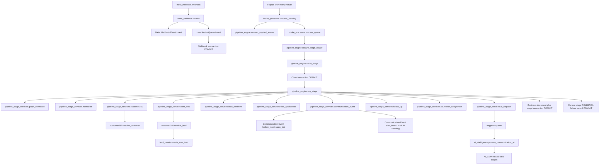

# Meta Pipeline Implementation Audit

Date: 2026-07-30

Repository: `/home/shahbaz/frappe-bench/apps/visa_crm`

Baseline commit: `c6e6fb6`

Baseline validation: 31 tests passed on local.test using Frappe 15.110.0, ERPNext 15.110.0, and CRM 1.73.0.

This audit compares the current runtime implementation with `META_PIPELINE_RESILIENCE_ARCHITECTURE.md`. It records facts before the remaining resilience work. The architecture document remains the source of truth.

## 1. Runtime Dependency Graph

## 2. Transaction Ownership

| Boundary | Owner | Commit | Rollback scope |
|---|---|---|---|
| Webhook ingestion | `meta_webhook.receive()` | Meta Webhook Event and Lead Intake Queue | Request transaction only |
| Stage claim | `pipeline_engine.claim_stage()` | RUNNING state and lease | Claim only |
| Graph download | `pipeline_engine.run_stage()` | Graph snapshot and GRAPH_DOWNLOAD completion | Graph stage only |
| Normalize | `pipeline_engine.run_stage()` | Normalized snapshot and NORMALIZE completion | Normalize stage only |
| Customer | `pipeline_engine.run_stage()` | Customer, Customer Identity rows, and CUSTOMER360 completion | Customer stage only |
| CRM Lead | `pipeline_engine.run_stage()` | CRM Lead, Customer link repair, and CRM_LEAD completion | Lead stage only |
| Workflow | `pipeline_engine.run_stage()` | Workflow changes and lifecycle hook side effects | Workflow stage only |
| Visa | `pipeline_engine.run_stage()` | Visa Application and VISA_APPLICATION completion | Visa stage only |
| Communication | `pipeline_engine.run_stage()` | Communication Event and COMMUNICATION_EVENT completion | Communication stage only |
| Follow-up | `pipeline_engine.run_stage()` | ToDo, reminder, activity, and FOLLOW_UP completion | Follow-up stage only |
| Assignment | `pipeline_engine.run_stage()` | Lead assignment and history | Assignment stage only |
| AI dispatch | `pipeline_engine.run_stage()` | Current code enqueues before stage completion commit | AI dispatch stage only, but enqueue ordering is unsafe |
| AI worker | `ai_intelligence._process_staged_ai()` | AI output and AI child stages | AI stage only |

The original shared rollback cascade is removed. Once CUSTOMER360 or CRM_LEAD commits, downstream failures do not delete those records.

## 3. Frappe Hooks Executed

### CRM Lead

Controller: `crm/fcrm/doctype/crm_lead/crm_lead.py`

1. Controller `before_validate()` sets SLA.
2. Visa CRM `before_validate` trace hook runs.
3. Controller `validate()` validates status, derives full name and lead name, validates email, and writes CRM status history.
4. Visa CRM `validate` trace hook runs.
5. Controller `before_save()` applies SLA.
6. Visa CRM lifecycle validates workflow transitions.
7. Visa CRM `before_save` trace hook runs.
8. Controller `after_insert()` assigns and shares when a lead owner exists.
9. Visa CRM `after_insert` trace hook runs.
10. Visa CRM `after_save` lifecycle hook writes stage side effects when the lifecycle stage changed.

No other installed app registers a `CRM Lead` document event. CRM registers permission query and permission checks only.

### Communication Event

1. Visa CRM `before_insert` runs `communication_event.auto_link()`.
2. Visa CRM `after_insert` runs `communication_center.after_communication_insert()`.
3. Meta communication currently stores the queue in `channel_id`; the hook recognizes this and marks queue AI Pending without enqueueing.

## 4. Scheduler and Worker Audit

- Hook method: `visa_crm.api.intake_processor.process_pending`
- Cron: `* * * * *`
- Scheduled Job Type exists and is enabled.
- Built-in CRM Meta scheduler wrappers are stopped on local.test.
- Local runtime reports no Scheduled Job Log execution and worker status is unavailable because bench services were not running during this audit.
- Atomic claim uses a SQL affected-row check and a lease token.
- Expired leases are recovered by the scheduler.
- There is no lease heartbeat. A stage running longer than 300 seconds can be reclaimed while the original worker is still active.
- One uncaught exception outside `run_stage()` can stop `process_pending()` before later queues are processed.
- Queue discovery performs repeated stage queries and is N+1 at scheduler scale.

## 5. Idempotency Audit

| Output | Current key | Physical uniqueness | Result |
|---|---|---|---|
| Lead Intake Queue | `source_lead_id` | Present on local.test | Good, duplicate webhook race handling still needs repair |
| Lead Intake Stage | `stage_key` | Present | Good |
| Customer Identity | `identity_hash` | Present | Good |
| CRM Lead | `facebook_lead_id` | Present | Good |
| Visa Application | `meta_intake_key` | Present | Key is good, but fallback by Lead can reuse a prior enquiry |
| Communication Event | `event_id` | Present | Good |
| ToDo | `meta_intake_key` | Present | Good |
| Reminder Scheduler | `meta_intake_key` | Migration attempts uniqueness | Must be verified on every target site |
| Activity Timeline | `meta_intake_key` | Migration attempts uniqueness | Must be verified on every target site |
| Lead Assignment | `meta_intake_key` | Present | Good |
| Assignment History | `meta_intake_key` | Migration attempts uniqueness | Must be verified on every target site |
| AI work item | None | None | Missing architecture requirement |
| AI-generated ToDo | Description lookup | None | Concurrent duplicate risk |
| AI timeline | None | None | Retry duplicate risk |

## 6. Field Preservation Audit

The immutable Graph response is retained in `Lead Intake Queue.graph_payload` and `graph_api_response`.

Canonical attribution fields exist on CRM Lead:

- `facebook_lead_id`
- `facebook_form_id`
- `facebook_page_id`
- `meta_campaign_id`
- `meta_campaign_name`
- `meta_adset_id`
- `meta_adset_name`
- `meta_ad_id`
- `meta_ad_name`

Customer intentionally has no campaign attribution because a Customer can have multiple enquiries.

Confirmed preservation gap:

- `meta_mapping._answers()` keeps only the first item in each Meta `values` array.
- Normalized keys can collide and overwrite an earlier answer.
- `meta_raw_fields` therefore contains a flattened dictionary rather than the complete original `field_data`.
- The full Graph payload remains available on the Queue, but the CRM Lead raw attribution is not complete.

## 7. Customer and Lead Relationship Audit

- Customer identity priority is External ID, Phone, WhatsApp, then Email.
- Customer name is never used as identity.
- Existing Customer without Lead results in Lead creation and linking.
- Existing Lead without Customer results in Customer creation and linking.
- CRM Lead `facebook_lead_id` is used as the Meta enquiry identity.
- A Customer may own multiple Meta enquiries. The scalar `Customer.crm_lead` field can represent only one primary Lead; the authoritative many-enquiry relationship is CRM Lead to Customer.

## 8. Confirmed Remaining Gaps

### Critical

1. AI enqueue happens before `AI_DISPATCH` completion commits. A fast worker can attempt `AI_GEMINI` while its dependency is still RUNNING and exit without processing.
2. There is no durable, unique AI work item or enqueue idempotency key.
3. No lease heartbeat exists for long-running stages, especially Gemini.
4. `Visa Application.create_for_lead()` falls back to any Visa Application for the Lead even when a queue-specific key is available. This can merge separate enquiries.

### High

1. Communication Event lacks explicit links to Lead Intake Queue and Follow-up; queue is stored in generic `channel_id`.
2. Assignment history does not retain the Communication Event reference even when the field exists.
3. AI provider exceptions are swallowed by `_gemini_json()` and converted to heuristic success, so Gemini outages do not produce a truthful FAILED AI stage.
4. AI-generated ToDo and timeline outputs are not concurrency-safe or retry-idempotent.
5. Webhook event documents are inserted and committed before signature validation, allowing unauthenticated payloads into the audit DocType.
6. Duplicate webhook insert uses `ignore_if_duplicate=True` but then links the event using the in-memory document name instead of re-querying the canonical queue.
7. `process_pending()` lacks per-queue exception isolation outside stage execution.
8. Existing operations APIs and the Intake Pipeline page report legacy queue status instead of the stage ledger.

### Medium

1. `last_progress_at` is updated by rollup reads even when no stage progressed.
2. Retry delay has no jitter and is not Graph error aware.
3. Scheduler queue discovery is N+1 and can be expensive at high volume.
4. Temporary CRM Lead lifecycle tracing logs full PII and entire documents at INFO level.
5. Built-in Meta source detection scans every value for broad substrings, including `fb`, which can misclassify future non-Meta sources.
6. Migration helpers skip unique indexes when duplicates exist but do not produce a durable repair record or deterministic canonicalization plan.
7. Local validation versions are Frappe/ERPNext 15.110.0 and CRM 1.73.0, not the production target 15.112.0 and CRM 1.77.x.

## 9. Required Implementation Order

1. Add explicit communication links, durable AI work item schema, and missing idempotency fields through a new idempotent patch.
2. Repair webhook canonical queue linking without changing payload format.
3. Preserve complete raw Meta `field_data` while keeping scalar mapped values backward compatible.
4. Add lease heartbeat and per-queue scheduler isolation.
5. Correct Visa, Communication, Follow-up, Assignment, and AI idempotency.
6. Move AI enqueue strictly after durable dispatch commit and make retries recoverable.
7. Make staged Gemini failures explicit while leaving business records untouched.
8. Rebuild diagnostics and operations UI from `Lead Intake Stage`.
9. Narrow built-in CRM Meta source detection.
10. Add the missing concurrency, worker-death, retry, migration-rerun, and provider-outage tests.
11. Run migrate twice, inspect physical indexes, run scheduler/runtime verification, and execute the full suite.

No production runtime code was changed as part of this audit.
