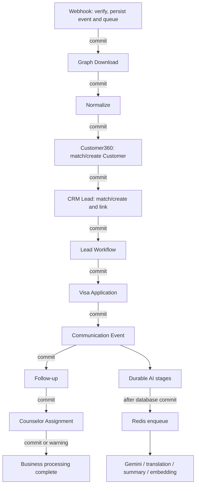
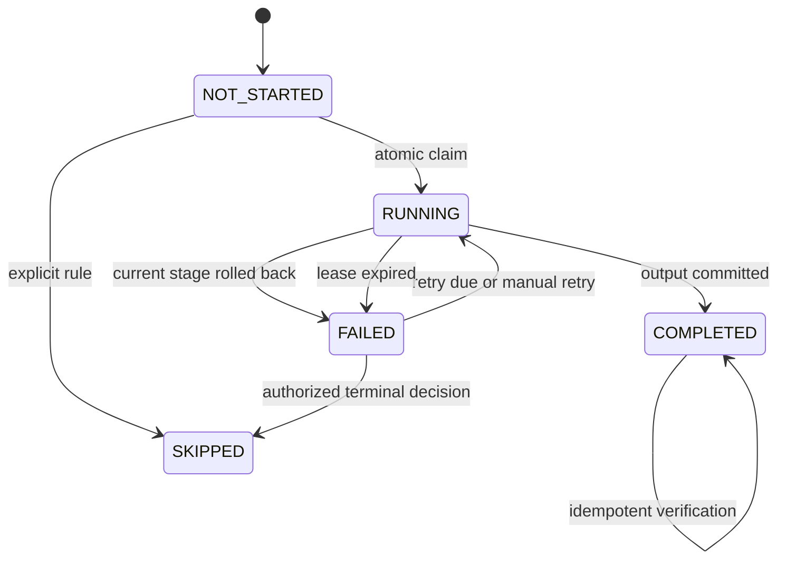
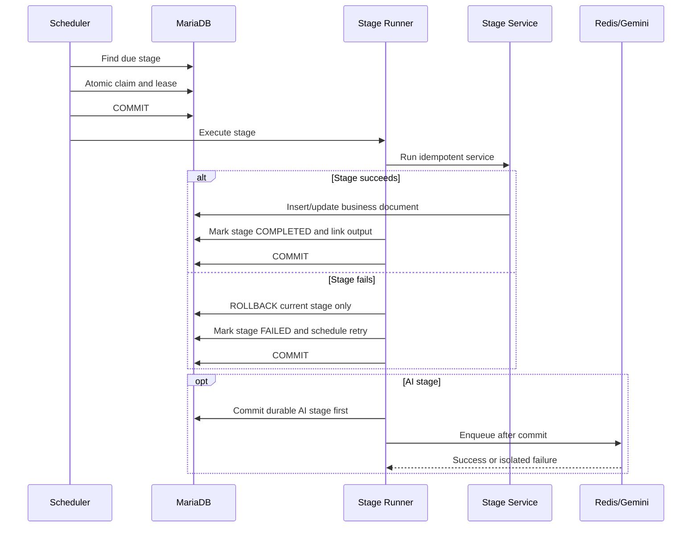

# Meta Lead Intake Resilience Architecture

Status: Proposed for review

Scope: Meta Lead Intake orchestration only

Implementation status: Design only. No runtime code or database schema is changed by this document.

## 1. Executive Decision

The pipeline will use a durable database-backed stage ledger. Each stage owns one short transaction, commits its business document and stage result together, and can be retried independently. A failure rolls back only the active stage. Previously completed stages and their business documents remain committed.

The `Lead Intake Queue` remains the root orchestration record and preserves backward-compatible links and summary status. A new `Lead Intake Stage` DocType becomes the source of truth for stage execution, attempts, leases, errors, timing, and retry scheduling.

The CRM Lead is the durable business checkpoint. Once the `CRM_LEAD` stage commits, no later failure may delete or roll it back. Visa, communication, follow-up, assignment, and AI failures become isolated stage failures.

## 2. Current Runtime Audit

### 2.1 Current execution chain

| Order | Current function | Current behavior |
|---|---|---|
| 1 | `meta_webhook.receive()` | Inserts `Meta Webhook Event` and `Lead Intake Queue`, then commits |
| 2 | `intake_processor.process_pending()` | Recovers stale `Fetching Meta Lead` rows and calls `process_queue()` |
| 3 | `intake_processor._claim()` | Changes queue to `Fetching Meta Lead`, then commits |
| 4 | `meta_graph.fetch_lead()` | Calls Meta Graph API |
| 5 | `meta_mapping.normalize_lead()` | Maps Graph `field_data` into normalized fields |
| 6 | `intake_processor._update_queue()` | Persists Graph and normalized data, then caller commits |
| 7 | `customer360.link_or_create_lead()` | Matches or creates CRM Lead and Customer, then links them |
| 8 | `visa_application.create_for_lead()` | Creates or updates Visa Application |
| 9 | `workflow.mark_lead_stage()` | Updates CRM Lead workflow and may create a Deal |
| 10 | `lead_assignment.assign_lead()` | Assigns counselor and creates assignment records |
| 11 | `intake_processor._communication_event()` | Creates Communication Event |
| 12 | `followup.create_meta_followup()` | Creates ToDo, reminder, and activity |
| 13 | `intake_processor._finish()` | Links outputs, sets queue `Processed`, then caller commits |
| 14 | `communication_center.enqueue_ai()` | Registers an after-commit Redis enqueue |

### 2.2 Confirmed transaction weakness

Graph download and normalization are committed at `intake_processor.py:54`. Everything from Customer360 through queue completion currently shares the transaction committed at `intake_processor.py:89`.

Any exception in that block reaches the broad handler at `intake_processor.py:98`, which calls `frappe.db.rollback()` at line 102. The explicit no-counselor exception at lines 78-79 can therefore roll back the newly created CRM Lead, Customer, Visa Application, workflow changes, assignment records, Communication Event, and follow-up records.

This is the root architectural defect. Individual exception wrappers cannot make the pipeline resilient while multiple business stages share one transaction and one queue status.

### 2.3 Existing useful safeguards to preserve

- Webhook queue insertion is committed before Graph processing.
- `source_lead_id` is intended to be unique on `Lead Intake Queue`.
- CRM Lead uses `facebook_lead_id` as its Meta identity.
- Communication Event uses `event_id = meta:<source_lead_id>`.
- Follow-up ToDo checks `reference_type` and `reference_name`.
- Visa Application checks for an existing application linked to the Lead.
- AI enqueue already uses an after-commit callback and records AI errors separately.
- Stale `Fetching Meta Lead` recovery already exists.

These safeguards will be retained and strengthened, not discarded.

## 3. Target Architecture

### 3.1 Components

1. **Queue repository**
   - Loads queue context.
   - Persists backward-compatible summary fields and output links.
   - Never owns business logic.

2. **Stage ledger**
   - One `Lead Intake Stage` row per queue and canonical stage.
   - Tracks state, attempt count, lease, timestamps, errors, input/output hashes, and created document.
   - Is the durable retry outbox for both business and AI work.

3. **Stage runner**
   - Atomically claims one due stage.
   - Executes only that stage.
   - Commits the business document and `COMPLETED` stage state together.
   - On failure, rolls back only the current stage and records `FAILED` in a new transaction.

4. **Stage services**
   - Thin adapters around existing Graph, mapping, Customer360, Lead, Visa, communication, follow-up, assignment, workflow, and AI functions.
   - Receive a persisted queue context and return a structured stage result.
   - Must be idempotent.

5. **Rollup service**
   - Derives queue `orchestration_status`, `current_stage`, warnings, and next action from stage rows.
   - Never infers stage success from a single broad exception.

6. **Schedulers**
   - Business scheduler scans due non-AI stages.
   - AI scheduler scans due AI stages.
   - Both use leases so a worker restart is recoverable.

## 4. Stage Model

### 4.1 Canonical primary stages

| Sequence | Stage | Requirement class | Dependency | Output |
|---:|---|---|---|---|
| 10 | `WEBHOOK` | Core | None | Meta Webhook Event and Lead Intake Queue |
| 20 | `GRAPH_DOWNLOAD` | Core | WEBHOOK | Graph request/response snapshot |
| 30 | `NORMALIZE` | Core | GRAPH_DOWNLOAD | Normalized payload and mapping version |
| 40 | `CUSTOMER360` | Core | NORMALIZE | Matched or created Customer |
| 50 | `CRM_LEAD` | Core checkpoint | NORMALIZE, CUSTOMER360 | Matched or created CRM Lead linked to Customer |
| 55 | `LEAD_WORKFLOW` | Required downstream | CRM_LEAD | Workflow state and optional Deal |
| 60 | `VISA_APPLICATION` | Required downstream | CRM_LEAD | Visa Application |
| 70 | `COMMUNICATION_EVENT` | Required downstream | CRM_LEAD | Communication Event |
| 80 | `FOLLOW_UP` | Required downstream | CRM_LEAD | Initial ToDo, reminder, and activity |
| 90 | `COUNSELOR_ASSIGNMENT` | Optional operational | CRM_LEAD | Counselor and assignment records |
| 100 | `AI_DISPATCH` | Optional | COMMUNICATION_EVENT | Durable Redis job submission |

AI processing is presented as one operations group but uses independently retryable child stages:

- `AI_GEMINI`
- `AI_TRANSLATION`
- `AI_SUMMARY`
- `AI_EMBEDDING`

### 4.2 State machine

Allowed states:

- `NOT_STARTED`: dependency is incomplete or stage has not been claimed.
- `RUNNING`: a worker owns a time-limited lease.
- `COMPLETED`: stage output and links are committed.
- `FAILED`: stage failed; retry metadata determines when it is eligible again.
- `SKIPPED`: stage is intentionally inapplicable, with a required reason.

State rules:

- `COMPLETED` is not reset by normal retries.
- `FAILED` can transition to `RUNNING` without restarting earlier stages.
- `RUNNING` with an expired lease becomes `FAILED` with `Worker lease expired`.
- A stage may be `SKIPPED` only when its requirement class permits it or an administrator records a reason.
- No stage may mark another completed stage failed.

## 5. Transaction Boundary Design

### 5.1 Transaction invariants

1. A stage claim is committed before external work starts.
2. Graph HTTP calls run without holding a database row lock.
3. Each business stage has its own transaction.
4. Business document creation and stage completion are committed atomically.
5. Failure recording occurs after rolling back only the active stage.
6. No broad rollback is allowed after the CRM Lead stage has committed.
7. Redis and Gemini calls occur only after durable database state exists.
8. No AI callback may update the queue's business-processing status.

### 5.2 Worker restart behavior

Each `RUNNING` stage stores:

- `lease_owner`
- `lease_token`
- `lease_expires_at`
- `started_at`

The scheduler can reclaim an expired lease. Idempotency checks run before creating any output, so a worker that died after document insertion but before stage completion will discover and link the existing document rather than duplicate it.

## 6. Queue Rollup Status

The stage ledger is authoritative. The existing queue `status` remains for compatibility, while a new `orchestration_status` gives operations a truthful summary.

| Orchestration status | Meaning |
|---|---|
| `Pending` | Core stage has not started |
| `Processing` | A stage is running |
| `Needs Retry` | A core stage before CRM Lead is failed and retryable |
| `Action Required` | A core stage before CRM Lead exhausted automatic retries |
| `Processed With Warnings` | CRM Lead exists, but one or more downstream/optional stages failed |
| `Processed` | All required stages completed; optional stages completed or were explicitly skipped |
| `Ignored` | Non-leadgen or recognized Meta test event |

Compatibility mapping:

- `Lead Received` remains the initial legacy status.
- `Processed` remains final clean success.
- Existing rows with a Lead plus downstream failures become `Processed With Warnings`, not `Failed`.
- Existing rows without a Lead and with a failed core stage become `Needs Retry` or `Action Required`.

## 7. Failure Policy

| Stage | Failure blocks later stages? | Can overall queue be generic `Failed`? | Retry |
|---|---|---|---|
| WEBHOOK | Yes | No; request result is explicit | Meta retries webhook |
| GRAPH_DOWNLOAD | Yes | No; `Needs Retry` | Exponential, Graph-aware |
| NORMALIZE | Yes | No; `Action Required` after limit | On mapping/config change |
| CUSTOMER360 | Yes | No; `Needs Retry` | Automatic/manual |
| CRM_LEAD | Yes | No; `Needs Retry` | Automatic/manual |
| LEAD_WORKFLOW | No deletion of Lead | No | Automatic/manual |
| VISA_APPLICATION | No deletion of Lead | No | Automatic/manual |
| COMMUNICATION_EVENT | No deletion of Lead | No | Automatic/manual |
| FOLLOW_UP | No deletion of Lead | No | Automatic/manual |
| COUNSELOR_ASSIGNMENT | No | No | Periodic until counselor available |
| AI stages | No | No | Independent AI policy |

No counselor behavior:

1. Keep CRM Lead and all completed outputs.
2. Set Lead operational status to `Needs Assignment` only when that value is valid for the installed metadata/workflow.
3. Mark `COUNSELOR_ASSIGNMENT = FAILED`.
4. Store `No eligible counselor configured`.
5. Set a retry time.
6. Continue all independent stages.
7. Roll up queue as `Processed With Warnings`.

## 8. Retry Engine

### 8.1 Eligibility

A stage is eligible when:

- state is `NOT_STARTED` and all dependencies are `COMPLETED` or permitted `SKIPPED`; or
- state is `FAILED`, `next_retry_at <= now`, and retry policy allows another attempt; or
- state is `RUNNING` and its lease expired.

### 8.2 Retry policy

- Network/Graph transient errors: exponential backoff with jitter.
- OAuth/token/configuration errors: long retry interval plus administrator alert.
- Validation/configuration errors: `Action Required`; retry after configuration changes or manual resume.
- No counselor: periodic operational retry without failing business processing.
- Redis unavailable: AI dispatch remains failed/pending and retries independently.
- Gemini 429/5xx: provider-aware backoff honoring `Retry-After` when available.
- Deterministic invalid input: no tight automatic loop.

### 8.3 Resume algorithm

1. Load stage rows for the queue.
2. Do not execute any `COMPLETED` stage.
3. Select the lowest-sequence eligible stage.
4. Claim it atomically using its current state and lease token.
5. Execute only that stage.
6. Recompute queue rollup.
7. Continue to the next eligible stage within the job budget, or yield for another worker.

The engine never restarts at Webhook unless the queue does not exist.

## 9. Idempotency Contract

| Output | Idempotency key | Required behavior |
|---|---|---|
| Lead Intake Queue | `source_lead_id` / Facebook Lead ID | One canonical queue per Meta lead |
| Meta Webhook Event | Event fingerprint plus received event record | Preserve deliveries; link every duplicate to canonical queue |
| Graph snapshot | Queue + Graph payload hash | Update successful snapshot; preserve attempt response in stage record |
| Normalized data | Queue + mapping version + Graph hash | Deterministic regeneration |
| Customer | Customer Identity registry | One Customer per normalized identity claim |
| CRM Lead | Unique `facebook_lead_id` | Match before insert; recover duplicate race |
| Visa Application | `meta_intake_key = visa:<queue>` | Exactly one initial application for this intake |
| Communication Event | Unique `event_id = meta:<source_lead_id>` | Match before insert; recover duplicate race |
| Initial Follow-up | `meta_intake_key = followup:<queue>` | Exactly one initial ToDo/reminder/activity set |
| Assignment | `meta_intake_key = assignment:<queue>` | One active initial assignment and one matching history entry |
| AI dispatch | `meta_intake_key = ai:<communication_event>:<pipeline_version>` | One durable AI work item per version |

### 9.1 Customer identity registry

A new `Customer Identity` DocType prevents concurrent duplicate Customers without making phone or email globally unique on Customer.

Fields:

- `identity_type`: Phone, WhatsApp, Email, External ID
- `identity_hash`: normalized value hash, unique
- `masked_value`: safe operational display
- `customer`: Link Customer
- `verified`
- `source`

Customer360 claims identities transactionally. Multiple identities may point to one Customer, and one Customer may own multiple enquiries. Raw phone/email values remain on authorized business documents; logs do not expose them.

## 10. Required Schema Changes

### 10.1 New DocType: Lead Intake Stage

Regular DocType, not a child table, so it can be indexed, claimed independently, retried, and queried efficiently.

Fields:

- `queue`: Link Lead Intake Queue, required
- `stage`: Select, required
- `sequence`: Int, required
- `parent_stage`: Data
- `requirement_class`: Select Core / Required Downstream / Optional
- `state`: Select NOT_STARTED / RUNNING / COMPLETED / FAILED / SKIPPED
- `attempt_count`: Int
- `max_attempts`: Int
- `next_retry_at`: Datetime
- `lease_owner`: Data
- `lease_token`: Data
- `lease_expires_at`: Datetime
- `started_at`: Datetime
- `completed_at`: Datetime
- `duration_ms`: Int
- `last_error_class`: Data
- `last_error`: Long Text
- `last_traceback`: Code
- `input_hash`: Data
- `output_hash`: Data
- `result_doctype`: Link DocType
- `result_name`: Dynamic Link
- `result_json`: Long Text
- `warning`: Check
- `skip_reason`: Small Text

Indexes:

- Unique `(queue, stage)`
- `(state, next_retry_at, sequence)`
- `(lease_expires_at, state)`
- `(queue, sequence)`

### 10.2 New DocType: Customer Identity

Fields and indexes:

- `identity_type`
- `identity_hash`, unique
- `masked_value`
- `customer`
- `verified`
- `source`
- Index `(customer, identity_type)`

### 10.3 Lead Intake Queue additions

- `orchestration_status`
- `pipeline_version`
- `current_stage`
- `last_progress_at`
- `next_action_at`
- `warning_count`
- `stage_summary_json`
- `duplicate_of`
- `normalization_version`
- `normalized_payload`
- `normalized_payload_hash`
- `graph_payload_hash`

Existing output links remain:

- `matched_lead`
- `matched_customer`
- `visa_application`
- `communication_event`
- `followup_reference`
- `assigned_employee`

Existing `status`, `retry_count`, `last_error`, and AI fields remain for backward compatibility but are derived summaries after migration.

### 10.4 Attribution fields

Persist attribution on the immutable queue snapshot, CRM Lead, and Visa Application:

- `facebook_lead_id`
- `facebook_form_id`
- `meta_page_id`
- `meta_campaign_id`
- `meta_campaign_name`
- `meta_adset_id`
- `meta_adset_name`
- `meta_ad_id`
- `meta_ad_name`

Customer does not receive mutable campaign fields because one Customer can have multiple enquiries. Revenue attribution should join Visa Application to its Lead/queue attribution.

### 10.5 Output idempotency fields

Add `meta_intake_key` where missing:

- Visa Application
- ToDo
- Reminder Scheduler
- Activity Timeline
- Lead Assignment
- Counselor Assignment History

Add unique indexes only after a duplicate preflight. Communication Event `event_id` and CRM Lead `facebook_lead_id` receive verified unique indexes when production data permits.

## 11. Operations Dashboard

The existing queue and diagnostics UI should read the stage ledger.

For each queue show:

- Overall orchestration status
- Current/next stage
- Stage state, attempts, duration, and timestamps
- Exact failure class and message
- Retry time
- Retry Stage button
- Resume Pipeline button
- Lead, Customer, Visa, Communication, Follow-up, assignment, and AI links
- Assigned employee
- Graph and normalized payload inspection with role restrictions

Colors:

- Green: COMPLETED
- Yellow: NOT_STARTED, RUNNING, or retry scheduled
- Red: FAILED
- Gray: SKIPPED

Admin actions:

- `Retry Stage` resets only the selected failed stage to eligible.
- `Resume Pipeline` schedules the first eligible incomplete stage.
- Completed stages require an explicit protected `Re-run Completed Stage` action and still use idempotency checks.

## 12. Migration Plan

### Phase A: Preflight, no behavior change

1. Verify no duplicate non-empty `source_lead_id`.
2. Inventory duplicate `facebook_lead_id`, Communication `event_id`, Visa per queue/Lead, initial follow-ups, and assignments.
3. Log conflicts without deleting or merging production records.
4. Create a migration report.

### Phase B: Additive schema

1. Create `Lead Intake Stage`.
2. Create `Customer Identity`.
3. Add queue summary and normalized snapshot fields.
4. Add attribution and idempotency fields only when missing.
5. Add non-unique query indexes first.
6. Clear affected DocType caches.

Every operation checks DocType, field, and index existence before creation.

### Phase C: Backfill stage ledger

For every existing queue, create missing stage rows using deterministic names and `ignore_if_duplicate`.

Backfill evidence:

| Stage | Completion evidence |
|---|---|
| WEBHOOK | Queue exists; Meta Webhook Event link when available |
| GRAPH_DOWNLOAD | Non-empty successful Graph payload/response |
| NORMALIZE | Normalized payload or existing custom answers/mapped fields |
| CUSTOMER360 | Valid `matched_customer` |
| CRM_LEAD | Valid `matched_lead` |
| LEAD_WORKFLOW | Existing Lead state consistent with prior processing |
| VISA_APPLICATION | Valid `visa_application` |
| COMMUNICATION_EVENT | Valid `communication_event` or matching Meta event ID |
| FOLLOW_UP | Valid `followup_reference` or matching queue reference |
| COUNSELOR_ASSIGNMENT | Valid employee and assignment record |
| AI stages | Existing queue AI status and Communication AI outputs |

Rules:

- Backfill never calls Meta, Gemini, assignment, or document-creation services.
- Backfill never deletes records.
- Existing links win over inferred matches.
- Ambiguous evidence creates `FAILED` or `NOT_STARTED` with a migration note, not a guessed link.
- Existing processed queues with missing optional stages become `Processed With Warnings`.

### Phase D: Dual-read

1. Write stage ledger while preserving current queue fields.
2. Diagnostics compare old summary status against stage rollup.
3. Production runs in observation mode before the new runner controls retries.

### Phase E: Activate staged runner

1. Scheduler selects eligible stages.
2. Existing `process_pending()` becomes a compatibility entry point delegating to the stage runner.
3. Existing public imports remain valid.
4. Broad Customer360-to-finish transaction is retired only after parity tests pass.

### Phase F: Constraints

After duplicate reports are clean:

- Add unique stage `(queue, stage)`.
- Confirm or add unique queue `source_lead_id`.
- Confirm or add unique Lead `facebook_lead_id`.
- Add unique output `meta_intake_key` constraints where safe.

### 12.1 Rerun and rollback safety

- Patches are idempotent and may be rerun.
- No patch drops fields, tables, statuses, or user records.
- Activation is separated from schema creation.
- If deployment stops after schema creation, the old pipeline still operates.
- If backfill stops halfway, rerun creates only missing stage rows.
- Rollback to old code leaves additive schema unused but harmless.

## 13. Test Strategy

### 13.1 Unit tests

- Every allowed and forbidden state transition.
- Atomic claim and lease token validation.
- Expired lease recovery.
- Dependency resolution.
- Overall queue rollup.
- Retry classification and backoff.
- Input/output hashing.
- Every idempotency key.
- Customer identity normalization and race handling.

### 13.2 Integration tests

| Scenario | Required assertions |
|---|---|
| Full success | Exactly one of every required output; queue Processed |
| Redis offline | Business outputs committed; AI failed/pending; queue not failed |
| Gemini offline | Business outputs committed; AI stage retry scheduled |
| No counselor | Lead retained; assignment failed; queue Processed With Warnings |
| Existing Customer only | Customer reused; one Lead created and linked |
| Existing Lead only | Lead reused; one Customer created and linked |
| Existing Customer and Lead | Both reused and linked |
| Neither exists | Exactly one Customer and one Lead created |
| Duplicate webhook | One canonical queue and one Lead; delivery events preserved |
| Visa failure | Lead and Customer committed; Visa retry resumes at Visa |
| Communication failure | Lead/Customer/Visa retained; retry resumes at Communication |
| Follow-up failure | Prior documents retained; retry resumes at Follow-up |
| Assignment failure | Prior documents retained; no pipeline rollback |
| Partial success | Overall status and warnings match stage ledger |

### 13.3 Worker-death matrix

Inject a process termination at each point:

1. After stage claim commit.
2. Before business insert.
3. After business insert but before commit.
4. After business document commit but before next stage claim.
5. After AI stage commit but before Redis enqueue.

For every stage:

- Lease recovery makes the stage eligible.
- Completed prior stages are not executed again.
- Uncommitted current-stage work is absent.
- Committed output is discovered by its idempotency key.
- Final document counts remain exactly one.

### 13.4 Concurrency tests

- Two workers claim the same stage.
- Duplicate webhook requests arrive concurrently.
- Two leads with the same phone/email claim one Customer identity.
- Two retries create Visa, Communication, Follow-up, and Assignment concurrently.

### 13.5 Regression requirements

- Preserve all existing Meta webhook, Graph mapping, Customer360, CRM Lead, campaign attribution, AI isolation, and built-in CRM sync-disable tests.
- Run tests against Frappe v15, ERPNext v15, and CRM v1.77.x metadata.
- Migration test starts from a production-like pre-stage schema with partial and failed queues.

## 14. Small Reviewable Implementation Commits

No implementation should begin until this document is approved.

1. `docs: define resilient Meta intake stage architecture`
2. `feat: add idempotent stage ledger and queue schema`
3. `test: add stage state machine and migration backfill coverage`
4. `feat: add atomic stage claims, leases, and rollup service`
5. `feat: stage Graph download and normalization`
6. `feat: stage Customer360 and CRM Lead checkpoint`
7. `feat: stage workflow, Visa, communication, and follow-up`
8. `feat: isolate counselor assignment as warning stage`
9. `feat: add durable AI dispatch and independent AI stages`
10. `feat: expose stage diagnostics and retry controls`
11. `test: add failure injection, restart, concurrency, and full-pipeline matrix`

Each commit must:

- Keep existing imports and public APIs compatible.
- Include tests for its stage.
- Pass migration twice against the same database.
- Demonstrate no duplicate output on rerun.
- Avoid unrelated cleanup.

## 15. Acceptance Criteria

The redesign is complete only when:

- A real Meta lead produces one canonical queue.
- Graph and normalized payloads remain stored even after later failures.
- Exactly one Customer and one CRM Lead are matched or created and linked.
- Once committed, CRM Lead survives every downstream exception.
- Visa, Communication, Follow-up, Assignment, and AI retry independently.
- No counselor results in `Processed With Warnings`, not queue failure.
- Redis or Gemini outages never roll back business records.
- A worker can die after every stage and resume without restarting completed stages.
- Duplicate webhook delivery creates no duplicate business document.
- Operations can see and retry the exact failed stage.
- Migration is additive, idempotent, and preserves every production row.

## 16. Files That Must Not Change During the Design Pass

This document intentionally makes no changes to:

- `visa_crm/api/meta_webhook.py`
- `visa_crm/api/intake_processor.py`
- `visa_crm/api/meta_graph.py`
- `visa_crm/api/meta_mapping.py`
- `visa_crm/api/customer360.py`
- `visa_crm/api/lead_creator.py`
- `visa_crm/api/visa_application.py`
- `visa_crm/api/communication_center.py`
- `visa_crm/api/followup.py`
- `visa_crm/api/lead_assignment.py`
- `visa_crm/api/workflow.py`
- `visa_crm/hooks.py`
- `visa_crm/patches.txt`

