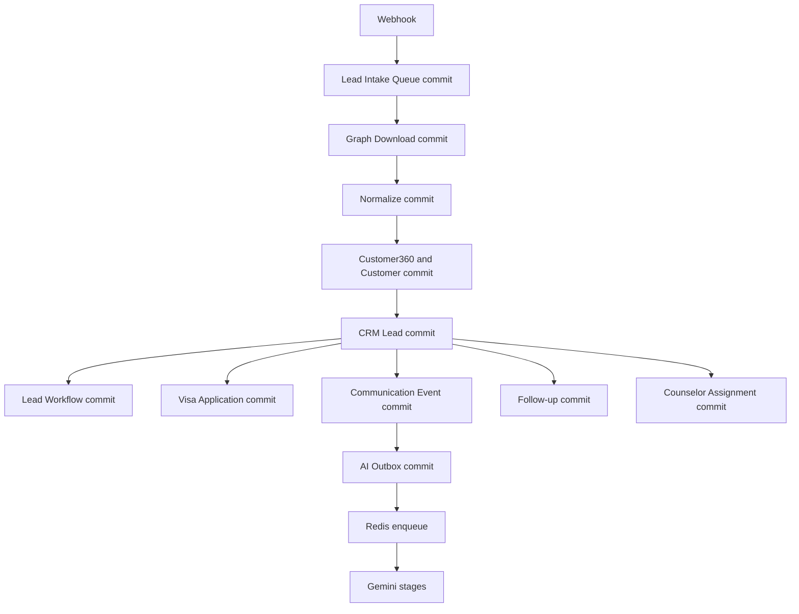

# Meta Pipeline Resilience Implementation Report

Date: 2026-07-30

## Result

The custom Visa CRM Meta pipeline is now stage-based, durable, resumable, idempotent, and isolated from optional AI and assignment failures. Lead Intake Queue remains the ingestion audit record. Every stage has an independent state, lease, retry count, timing, traceback, and output reference in Lead Intake Stage.

## Runtime Flow



## Stage Model

Each stage uses `NOT_STARTED`, `RUNNING`, `COMPLETED`, `FAILED`, or `SKIPPED`.

| Stage | Class | Durable output | Failure effect |
|---|---|---|---|
| WEBHOOK | Core | Lead Intake Queue | Request fails before ingestion |
| GRAPH_DOWNLOAD | Core | Immutable Graph snapshot | Retry Graph only |
| NORMALIZE | Core | Versioned normalized payload | Retry normalization only |
| CUSTOMER360 | Core | Customer and identities | Retry Customer stage only |
| CRM_LEAD | Core | CRM Lead linked to Customer | Retry Lead stage only |
| LEAD_WORKFLOW | Required | Lead workflow/deal state | Queue partially completed |
| VISA_APPLICATION | Required | Visa Application | Lead and Customer remain |
| COMMUNICATION_EVENT | Required | Communication Event | Prior records remain |
| FOLLOW_UP | Required | ToDo/reminder/timeline | Prior records remain |
| COUNSELOR_ASSIGNMENT | Optional | Assignment/history | Completed with warnings |
| AI_DISPATCH | Optional | Lead Intake AI Job | Business queue remains processed |
| AI_GEMINI | Optional | AI result | AI failed only |
| AI_TRANSLATION | Optional | Translation result or explicit skip | AI failed only |
| AI_SUMMARY | Optional | Summary result | AI failed only |
| AI_EMBEDDING | Optional | Embedding result or explicit skip | AI failed only |

## Transaction Boundaries

`claim_stage()` atomically claims and commits a lease. The stage handler then runs in a new transaction. The created or updated business document and `complete_stage()` checkpoint commit together. An exception rolls back only the active stage transaction. Previously completed stages are already committed and cannot be rolled back by later work.

AI uses a durable outbox. `AI_DISPATCH` commits `Lead Intake AI Job` before contacting Redis. Redis or Gemini failure updates only the AI job, AI stage, and queue AI fields.

## Identity and Idempotency

- Queue identity: `Lead Intake Queue.source_lead_id`
- Lead identity: `CRM Lead.facebook_lead_id`
- Customer identity priority: Meta external ID, normalized phone/WhatsApp, email
- Stage identity: `queue:stage`
- Visa identity: `visa:<queue>`
- Communication identity: `meta:<facebook_lead_id>`
- Follow-up identity: `followup:<queue>`
- Assignment identity: `assignment:<queue>`
- AI identity: `ai:<communication_event>:<pipeline_version>`

Name is never used as a Customer360 identity.

## Canonical Attribution

Lead Intake Queue retains the immutable Meta payload. CRM Lead stores read-only operational attribution:

- `facebook_lead_id`
- `facebook_form_id`
- `facebook_page_id`
- `meta_campaign_id`
- `meta_campaign_name`
- `meta_adset_id`
- `meta_adset_name`
- `meta_ad_id`
- `meta_ad_name`

Migration backfills only blank CRM Lead fields. Customer does not store campaign attribution because one Customer can have multiple enquiries.

## Physical Database Verification

Verified on `local.test`:

- Queue source identity unique
- Stage key unique
- Customer identity hash unique
- CRM Lead Facebook lead identity unique
- Communication event identity unique
- AI job identity unique
- Due-stage, lease, queue-stage, identity-customer, communication-queue, and AI due/queue indexes present
- Duplicate groups for all identity columns: zero

Run:

```bash
bench --site <site> execute visa_crm.patches.finalize_meta_pipeline_resilience.verification
```

The result must contain `"ok": true`.

## Recovery

- Atomic SQL stage claiming prevents two workers from owning the same stage.
- Heartbeat and lease expiry recover interrupted stages.
- Legacy `Fetching Meta Lead` records are recovered.
- Stale `QUEUED` or `RUNNING` AI outbox jobs become retryable.
- Manual Retry extends an exhausted stage by exactly one attempt.
- Resume continues from the first eligible incomplete stage.
- A completed Graph snapshot is never downloaded again during retry.

## Operations

The Lead Intake Pipeline Desk page shows every stage, state, timestamps, duration, attempts, worker, linked output, error, and traceback. System Managers can retry a failed stage or resume a queue. Production diagnostics now read the stage ledger rather than infer progress from the legacy queue status.

The built-in CRM Meta scheduler remains disabled only for sources positively identified as Meta/Facebook/Instagram providers. Non-Meta Lead Sync Sources remain untouched.

## Migration

New patch:

`visa_crm.patches.finalize_meta_pipeline_resilience`

It is idempotent and:

- Rechecks fields and indexes
- Backfills missing stage rows and attribution without overwriting valid data
- Repairs Communication, Assignment, and AI outbox links
- Applies canonical queue rollups
- Makes queue audit and CRM Lead attribution fields read-only
- Logs physical schema verification

The patch and full `bench migrate` were each rerun successfully.

## Automated Verification

Final local result: 45 tests passed.

Covered scenarios:

- Full production-style pipeline
- Duplicate webhook delivery
- Duplicate Graph reuse
- Multilingual and multi-value Meta mapping
- Customer exists
- Lead exists
- Customer-only and Lead-only relationship repair
- Downstream document idempotency
- One stage per worker invocation
- Graph failure and resume
- Visa failure and resume
- Communication failure and resume
- No counselor
- Redis offline
- Gemini offline
- Stale stage lease
- Stale AI outbox
- Exhausted manual retry
- Failure-handler failure
- Scheduler queue isolation
- Repeated migration/backfill

Also passed:

- Full Python compilation
- JavaScript syntax checks
- `git diff --check`
- Asset build
- Repeated migration
- Physical schema verification

## Deployment

Frappe Cloud must deploy the Git commit before migration. Do not run the new migration against old application code.

For a self-managed bench:

```bash
cd ~/frappe-bench
bench --site <site> backup --with-files
cd apps/visa_crm
git pull origin main
cd ~/frappe-bench
bench --site <site> migrate
bench build --app visa_crm
bench --site <site> clear-cache
bench restart
bench --site <site> execute visa_crm.patches.finalize_meta_pipeline_resilience.verification
bench --site <site> execute visa_crm.api.production_diagnostics.scheduler_diagnostics
```

## Rollback

The migrations are additive. A code rollback does not remove new fields, stage rows, audit records, or indexes. Do not manually delete them. If a deployment must be fully reverted, restore the pre-deployment site backup and deploy the previous Git revision together.

## Remaining Validation Risks

- Local verification used Frappe/ERPNext 15.110.0 and CRM 1.73.0. Production targets Frappe/ERPNext 15.112.0 and CRM 1.77.x; the implementation uses stable Frappe v15 APIs, but the exact target combination still requires staging deployment verification.
- The local bench had no running worker registry during the final diagnostic, so `last_run` was null even though the one-minute scheduler was registered, enabled, and detectable. Frappe Cloud worker status must be checked after deployment.
- Tests use mocked Meta and Gemini network responses. A real lead smoke test remains required after deployment.
- No high-volume benchmark was run in this stabilization session. Monitor queue latency and MariaDB query time during the first production volume window.
